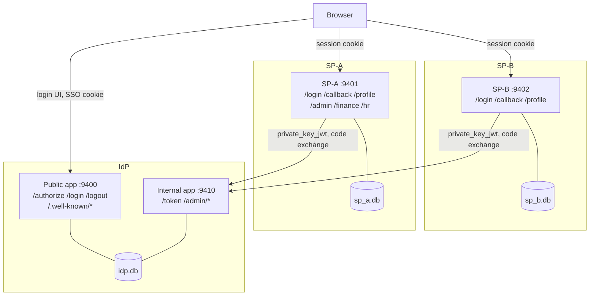

# Identity Fabric — Design Document

A minimal but security-serious **Single Sign-On (SSO)** trust fabric: one Identity
Provider (**IdP**) that several applications (**Service Providers / SPs**) trust to
identify a user. A user signs in **once** at the IdP; every SP then establishes its
own authenticated session for that user without ever seeing the password.

The protocol is **OpenID Connect (OIDC) Authorization Code + PKCE**, with
**private_key_jwt** client authentication and an **Ed25519 (EdDSA) JWKS** signing
layer.

---

## 1. Goals & Non-Goals

### Goals
- One login at the IdP → authenticated sessions at ≥ 2 SPs.
- Implement, deeply, all five requested security properties:
  1. **Signing-key rotation**
  2. **IdP ↔ SP mutual authentication**
  3. **Cross-SP integrity** (a token for SP-A is useless at SP-B)
  4. **Compromise containment** (revoke one key / one session without collapsing the fabric)
  5. **Session lifecycle & persistence** (idle + absolute timeouts, logout propagation, survives restart)
- Clean **API / service / persistence** layering, fully async, fully typed.
- No hardcoded HTTP status codes, no hardcoded secrets. Keys are generated at bootstrap.

### Non-Goals
- Not a production user directory. Users and SPs are **seeded**.
- No account self-service, MFA, consent screens, or federation to external IdPs.
- Not hardened for the public internet (runs on `localhost` over HTTP for the demo).

---

## 2. Topology



Each service is an independent FastAPI app with its **own** SQLite database. There is no
shared datastore. The IdP itself is two processes — a public one (login UI, `/authorize`,
JWKS/discovery) and an internal one (`/token`, `/admin/*`) — see §5.7. Whether the
per-service separation is merely *logical* or actually *enforced* depends on how it is
run — see [§10, Deployment & isolation](#10-deployment--isolation), which is a
first-class part of the containment story, not an afterthought.

---

## 3. Layering

Every service is split into three packages with a strict dependency direction
(`api → service → persistence`; `api` never touches the DB directly):

| Layer | Responsibility | May depend on |
|-------|----------------|---------------|
| `api/` | HTTP routes, request/response models, status codes, cookies | `service`, `common` |
| `service/` | Business logic, crypto orchestration, invariants | `persistence`, `common` |
| `persistence/` | Async repositories + ORM models (SQLAlchemy 2.0) | `common` |
| `common/` (shared) | Config, clock, crypto primitives, domain DTOs, DB engine factory | — |

All boundaries carry **Pydantic v2** models or explicitly typed values. The code is fully
type-annotated and `mypy --strict` is configured as the target (not asserted clean here —
`joserfc`/SQLAlchemy would need some stub wrangling).

---

## 4. Core Protocol Flow

### 4.1 First login (e.g. user hits SP-A)
1. **SP-A** has no local session → generates `state`, `nonce`, PKCE `code_verifier`/`code_challenge`, stores them in a short-lived pending-auth row, and 302-redirects the browser to the IdP `/authorize`.
2. **IdP** has no IdP session cookie → renders the **login UI**. User submits credentials; the IdP verifies them with **Argon2id** and creates a **server-side IdP session** (random `sid`, persisted, set as an `httpOnly`, `SameSite=Lax` cookie).
3. IdP validates the `client_id` + `redirect_uri` against the registered SP, mints a single-use **authorization code** bound to `(client_id, sid, code_challenge, nonce)`, and 302-redirects back to SP-A's `redirect_uri` with `code` + `state`.
4. **SP-A** backend calls IdP `/token` (server-to-server via `httpx`), authenticating with **private_key_jwt**: it signs a client-assertion JWT with its own Ed25519 key. It also sends the PKCE `code_verifier`.
5. **IdP** verifies the client assertion against SP-A's **registered public key** (mutual auth, SP side), validates PKCE, consumes the code, and returns an **`id_token`** + **`access_token`** — both JWTs signed with the IdP's active Ed25519 key, carrying `aud = "sp-a"`, `azp = "sp-a"`, `sid`, `jti`, `iat/nbf/exp`.
6. **SP-A** verifies the tokens against the IdP **JWKS** (fetched from discovery, cached, refreshed on unknown `kid`), checks `iss / aud / azp / nonce / exp` (mutual auth, IdP side), then creates its **own** local SP session.

### 4.2 SSO to SP-B
User visits SP-B → SP-B redirects to `/authorize` → the IdP **already** has a valid
session cookie → it skips the login UI and immediately issues a code → SP-B exchanges
it and gets its **own** token with `aud = "sp-b"`. One password entry, two sessions.

---

## 5. Feature Deep-Dives

### 5.1 Signing-key rotation
- The IdP owns a **keyring** table: each row is an Ed25519 keypair with a `kid`, a
  `status` (`active` | `retiring` | `retired` | `revoked`), and timestamps.
- Signing always uses the single `active` key. JWKS publishes the **public** halves of
  the `active` **and** `retiring` keys (the verification overlap window).
- `POST /admin/keys/rotate` generates a fresh key, marks it `active`, and demotes the
  previous active key to `retiring`. Tokens already in the wild still verify because the
  retiring key stays in JWKS.
- `POST /admin/keys/{kid}/retire` moves a `retiring` key to `retired` (dropped from
  JWKS) once its tokens have expired.
- SPs cache JWKS and **re-fetch on an unknown `kid`**, so rotation needs no SP restart.

### 5.2 IdP ↔ SP mutual authentication
- **SP proves itself to the IdP:** `/token` requires `private_key_jwt` — the SP signs a
  client assertion (`iss=sub=client_id`, `aud=token endpoint`, `jti`, short `exp`) with
  its Ed25519 private key. The IdP verifies it against the SP's registered public JWK.
  There is **no shared client secret** to leak. Assertion `jti`s are single-use.
- **IdP proves itself to the SP:** every token is signed by the IdP's JWKS key and
  carries the expected `iss`. The SP rejects anything it cannot verify against
  discovered JWKS or whose `iss` is wrong.

### 5.3 Cross-SP integrity
- Tokens are **audience-bound**: `aud` and `azp` name exactly one SP.
- Each SP verifies `aud == <its own client_id>`. A token minted for SP-A presented at
  SP-B fails the audience check → **rejected**. This defeats token-confusion / replay
  across SPs. Verified live against the container deployment — see `docs/flows/02-login-sso.md`.

### 5.4 Compromise containment
- **Key compromise (IdP):** `POST /admin/keys/{kid}/revoke` sets a key to `revoked` and
  drops it from JWKS immediately. Every token signed by that `kid` fails verification at
  all SPs at once — blast radius is one key, not the fabric.
- **Key compromise (an SP's own `private_key_jwt` key):** unlike IdP keys, an SP's key
  has no expiry — a leak is otherwise permanent. `POST /admin/clients/{client_id}/revoke-key`
  sets `ClientRow.key_revoked`, which `ClientService.authenticate` checks *before* even
  attempting signature verification, so it takes effect immediately and needs no access
  to the SP's own database (which the IdP shouldn't have anyway — see [§10](#10-deployment--isolation)).
  Recovery is two steps by design: `scripts/rotate_sp_key.py <client_id>` generates a
  fresh keypair **inside that SP's own database only** and prints the new public JWK;
  the operator then submits *only* that public half to `POST
  /admin/clients/{client_id}/register-key`, which validates it's a well-formed Ed25519
  public key (rejecting anything carrying a private `d` component) and clears
  `key_revoked`. The private half never leaves the SP, matching the same "IdP never
  holds a private client key" invariant seeding already established.
- **Session compromise:** each IdP session row carries a `revoked` flag checked on every
  request. `POST /admin/sessions/{sid}/revoke` sets it **and** fires **back-channel
  logout** to every SP that has a session for that `sid`, so a stolen session dies
  everywhere.
- **Scope of blast radius:** short-lived access tokens (minutes) bound the window. Per-SP
  databases *also* mean a breached SP cannot read the IdP's user or key material — **but
  only when the separation is enforced by the runtime** (containers or separate OS users).
  In the plain local run all three processes share a user and directory, so that
  particular guarantee is logical, not enforced. See [§10](#10-deployment--isolation).

### 5.5 Session lifecycle & persistence
- **IdP session:** `sid`, subject, `created_at`, `last_seen_at`, `idle_expiry`,
  `absolute_expiry`. Idle timeout slides on use; absolute timeout is a hard cap.
- **SP session:** analogous, independent per SP.
- All sessions live in SQLite, so they **survive a service restart**.
- **Logout:** RP-initiated logout at an SP calls the IdP, which terminates the IdP
  session and back-channel-notifies the other SPs; each SP tears down its local session.

### 5.6 Detection: audit logging & alerts
Containment is only half of an incident — you also have to *see* it. `common/audit.py`
gives every service one path (`AuditLog.record`) that does three things at once:

- **Structured JSON logs** on a dedicated `fabric.audit` logger (independent of uvicorn),
  every line tagged with `service`, `event`, `severity`, `request_id`, `source_ip`,
  `subject`/`client_id`, and a free-form `detail`. A request-id middleware correlates all
  events within a request.
- **A persistent audit trail** — the same event is written to an append-only
  `audit_events` table in *that service's own* database (the row class is injected, so
  each DB keeps its own trail). Readable at `GET /admin/audit`.
- **Alerts** — `ALERT`-severity events are tagged `"alert": true` and pushed to every
  registered sink (a loud stderr banner by default; `register_alert_sink` accepts a
  webhook). This is log-based alerting, not a pretend pager integration.

The high-signal events are the ones that shouldn't happen in normal operation:
`assertion.replay.detected` and `client.auth.failed` (a failed IdP↔SP mutual auth) fire as
alerts, as do the containment actions themselves (`key.revoked`, `session.revoked`,
`client.key.revoked`).
Routine events (`auth.login.succeeded/failed`, `token.issued/denied`,
`sp.login.*`, `sp.backchannel.*`, `key.rotated/retired`, `logout.backchannel.sent`,
`client.key.registered`) are logged at info/notice/warning. Logging and alerting fire
immediately, independent of the request's DB transaction, so a rolled-back request still
leaves a durable log + alert.

The `source_ip` on every event is only ever taken from `X-Forwarded-For` when the direct
TCP peer is in `FABRIC_TRUSTED_PROXY_IPS` — otherwise it's the raw peer address. With no
reverse proxy in front by default, honoring that header unconditionally would let any
caller forge the source IP its own security-relevant actions get logged under. That check
only means anything because every `uvicorn` invocation also passes
`--forwarded-allow-ips ""`: uvicorn ships its own `ProxyHeadersMiddleware`, trusting
`127.0.0.1` by default, that rewrites `request.client` *ahead of* any application code —
so the app-level check alone was not sufficient; the transport layer has to stop lying
about the peer address first.

### 5.7 Network placement as a containment lever
`private_key_jwt` and the admin token are both purely credential-based: nothing in
`ClientService.authenticate` or `require_admin` checks *where* a request came from, only
*what it can prove*. That means container network segmentation between SP-A and SP-B
(§10.1) never protected the token/admin surface in the first place — a leaked SP key or
admin token is exactly as usable from outside the segmented topology as from inside it,
because the IdP's port was published straight to the host.

`idp/main.py` splits the IdP into two ASGI apps to make network placement actually mean
something for that surface: `app` (public — discovery, JWKS, login UI, `/authorize`,
`/logout`) and `internal_app` (`/token`, `/admin/*`). Under `compose.yaml`, `idp-internal`
carries the internal app and has **no `ports:` entry** — reachable only from `sp-a`/`sp-b`
over the compose network, or via `podman compose exec`. This doesn't stop a stolen key
from working *inside* the network it's reachable from, but it does mean that network is
no longer "the whole internet, plus every container" — closing the specific gap where
container isolation looked like a mutual-auth boundary but wasn't one.

### 5.8 Group-based SP access, and SP-local roles

**The gap this closes:** SSO by itself only answers "is this person authenticated" —
without this, any authenticated user could reach *any* registered SP, because nothing
ever checked whether they should be able to. Real IdPs (Okta, Azure AD) treat this as a
mandatory step ("assignments") when onboarding an app, not an optional extra.

- **`UserRow.groups`** (IdP) — coarse, stable org/team membership (`engineering`,
  `finance-dept`, `hr-dept`). This is the *only* new thing the IdP holds for this
  feature; it is never asserted as a token claim.
- **`ClientRow.authorized_groups`** (IdP) — which groups may SSO into a given client at
  all. Empty (the default for a newly registered client — see §5.9) denies everyone.
- **Enforcement**: `idp/api/auth_ui.py::_resume_authorization` — the single function
  both the fresh-login path (`login()`) and the silent SSO-resume path (`authorize()`
  with an existing session) call before minting an authorization code. If
  `user.groups ∩ client.authorized_groups` is empty, no code is minted, no token is ever
  possible for that pair, and the user gets a 403 — but keeps their IdP-wide SSO cookie,
  since this is a per-SP authorization decision, not an authentication failure.
- **Roles moved out of the IdP entirely.** Fine-grained permissions (`admin`, `finance`,
  `hr`, …) are inherently per-application and proliferate — centralizing them would mean
  every SP's private role vocabulary living in IdP schema/seed data forever. Each SP now
  keeps its own `SPUserRoleRow(subject, roles)` table, populated independently: the
  *same* person can be `admin` at one SP and a plain `user` at another. A first-ever
  login with no seeded row defaults to `["user"]`.
- **Admin levers**: `POST /admin/clients/{client_id}/groups/{group}/authorize` and
  `.../revoke` — same shape as the key-revoke/session-revoke containment levers already
  in §5.4.

### 5.9 Dynamic client registration

Beyond the two seeded SPs, `POST /admin/clients` registers a new client with
`public_jwk=None` (a real, nullable "pending" state — `ClientService.authenticate`
rejects it with a specific error rather than a low-level crypto failure) and
`authorized_groups=[]`. The existing `register-key` endpoint (§5.4) doubles as the
"complete registration" step with no changes needed. This mirrors how a real IdP
onboards an app — create it, get pending credentials, submit the key — as an explicit,
auditable admin action instead of only the automatic seed-time script (§10.2's "trusted
provisioner").

---

## 6. Token & Claim Shapes

`id_token` / `access_token` (EdDSA, `kid` in header):

| Claim | Meaning |
|-------|---------|
| `iss` | IdP issuer URL |
| `sub` | stable user id |
| `aud` | target SP `client_id` (**cross-SP integrity**) |
| `azp` | authorized party = same SP |
| `sid` | IdP session id (enables back-channel logout & revocation) |
| `jti` | unique token id (revocation granularity) |
| `nonce` | echoes the SP's nonce (id_token only) |
| `iat`/`nbf`/`exp` | issuance / not-before / expiry |
| `email`, `name` | seeded profile claims (id_token) |

No `roles` claim — roles are deliberately not an IdP concept at all (see §5.8). `groups`
is also never a claim: it's an IdP-internal input to the access-gate check in
§5.8, checked before a token is minted, never asserted to anyone afterward.

---

## 7. Technology Choices

| Concern | Choice | Why |
|---------|--------|-----|
| Web framework | FastAPI + Uvicorn | Async, typed, your stack |
| Models / config | Pydantic v2 + pydantic-settings | Typed boundaries; env-driven config |
| JOSE / JWT / JWKS | **joserfc** + cryptography | Maintained by the Authlib author; avoids the stale, CVE-prone `python-jose` |
| Signing algorithm | **Ed25519 / EdDSA** | Small, fast, modern; no parameter/padding foot-guns |
| Password hashing | **argon2-cffi** (argon2id) | Current best-practice memory-hard KDF |
| Persistence | SQLAlchemy 2.0 async + aiosqlite | Fully async, zero external services on the M1 |
| HTTP client (SP→IdP) | httpx (async) | JWKS + token exchange |
| Templates | Jinja2 | Polished login UI |

No Redis, no Postgres. The default run is three `uvicorn` processes and three SQLite
files; an optional Podman deployment adds enforced isolation (see §10). Container images
are built from a single `Containerfile`; orchestration is a `compose.yaml`.

---

## 8. Security Posture & Explicit Trade-offs

- **Local-only demo:** `Secure` cookie flag and HTTPS are config-gated off for
  `localhost`. In production both must be on, plus HSTS.
- **Discovery/JWKS over HTTP** on localhost; production requires TLS + `iss` pinning.
- **Admin endpoints** are protected by a bootstrap admin token (generated, printed
  once, never hardcoded). They are demo tooling, not a real admin console.
- **Single-use** authorization codes and client-assertion `jti`s; PKCE is mandatory.
- Access tokens are short-lived; there is no long-lived refresh token in this build
  (the IdP session is the renewal anchor) to keep the revocation story crisp.
- **No real migration system.** `common/database.py::create_all` creates missing tables
  and additively patches missing *columns* (`ALTER TABLE ... ADD COLUMN`, always
  nullable — existing rows get `NULL`), which is enough to survive an added column like
  `ClientRow.key_revoked` without wiping data. It cannot rename, drop, retype a column,
  or backfill anything other than `NULL`. A real migration tool (Alembic) is the right
  answer past this scale. Concretely: `UserRow.roles` was dropped in favor of `groups`
  (§5.8) — that's exactly the kind of change this shim can't handle cleanly, so it's
  treated as breaking: `rm -f data/*.db` (or `docker compose down -v`) before the first
  boot after that change, same as every other schema-affecting change in this project.

---

## 9. Repository Map

```
src/fabric/
  common/         config, clock, crypto (Ed25519/JWT/JWKS), domain DTOs, db engine, oauth constants,
                  audit (JSON logs + audit trail + alert sinks)
  seed.py         provisions all DBs: users (+groups), SP registry (+public keys, authorized_groups,
                  per-SP local roles), first signing key, admin token
  idp/
    api/          oidc (jwks/discovery — public), token (/token — internal),
                  auth_ui (home/login/logout — public, group-authorization gate — §5.8),
                  admin (+audit view, key/session/client-key containment, dynamic client
                  registration + group grants — §5.8/5.9 — internal)
    main.py       `app` (public ASGI app) + `internal_app` (token + admin ASGI app) — see §5.7
    service/      keys, sessions, clients (+ dynamic registration, group grants), users (+ groups), flows, logout
    persistence/  ORM models (+audit_events) + async repositories        →  idp.db
  sp/
    api/          routes (home/login/callback/profile/logout/backchannel-logout,
                  admin/finance/hr — role-gated, §5.8)
    service/      idp_client (discovery + JWKS cache), login, sessions (local role lookup)
    persistence/  ORM models (+audit_events) + async repositories        →  sp_a.db / sp_b.db
scripts/rotate_sp_key.py  SP-key-compromise recovery (§5.4): fresh keypair, that SP's DB only
Containerfile             single image for all roles
compose.yaml              isolated Docker/Podman topology (provisioner + segmented services
                          + `idp-internal`, which has no published port — see §5.7)
container-start.sh        Docker-if-available, else install+use Podman, then compose up --build
```

---

## 10. Deployment & Isolation

This is a container-only project — there is no local-process run mode. Every
per-service separation described below is *enforced by the runtime*, not just logical.

### 10.1 Containers (Podman/Docker — enforced isolation)
`compose.yaml` enforces the per-service separation along three axes:

- **Filesystem** — each server mounts **only its own volume**. `idp.db` and the sibling
  SP's DB are not on any path a compromised SP can open.
- **Network** — SP-A and SP-B sit on **disjoint networks**, so there is no route between
  them. Each SP↔IdP path exists (discovery/JWKS/token; and IdP→SP for back-channel
  logout), and nothing exposes a database port. The internal IdP surface (`idp-internal`
  — `/token`, `/admin/*`) has **no host-published port at all** — see §5.7. This is the
  one axis that isn't purely inter-SP: without it, `/token` and `/admin` were reachable
  from outside the segmented topology entirely, which meant SP-A/SP-B network separation
  never actually gated a stolen key or the admin token in the first place.
- **Process** — each service is its own container/namespace with its own lifecycle.

This is the deployment realization of the compromise-containment goal in §5.4: a popped SP
is boxed into its own volume and network segment.

### 10.2 Seeding under isolation — the "trusted provisioner" (Option A)
Seeding writes to *all three* databases, which is exactly the cross-volume access the
runtime forbids. We resolve this with a **one-shot provisioner container** that mounts all
three volumes, runs `fabric.seed`, prints the one-time admin token, and exits **before**
the servers start (`depends_on: service_completed_successfully`). Provisioning is a
trusted deploy-time act, not part of the runtime attack surface; no long-running component
ever holds more than one volume.

> Considered alternative (Option B, not built): each SP generates its own keypair in its
> own container and **registers its public key** with the IdP over HTTP at startup. More
> architecturally pure (no component ever touches two volumes, even at bootstrap) at the
> cost of a registration protocol and trust-on-first-use handling.

### 10.3 Hostname model
Tokens and the browser must agree on names, so the *same* issuer/base string is used
everywhere. Services are reached by name (`idp`, `idp-internal`, `sp-a`, `sp-b`) —
resolvable inside the pod networks via container DNS and on the host via a single
`/etc/hosts` entry (`127.0.0.1 idp sp-a sp-b`). This keeps `iss` identical for the
browser redirect path and the server-to-server calls, so no internal/external issuer
split is needed. Config exposes per-service host and per-database overrides
(`FABRIC_SP_A_HOST`, `FABRIC_IDP_DB_FILE`, …) to make this possible.

### 10.4 What containers do and do not buy
They contain **ordinary app-level compromise** — RCE that reads the filesystem or moves
laterally over the network — which is the realistic "SP got popped" case. They are **not**
a boundary against a **kernel/container-escape 0-day**; that tier needs separate VMs or
hosts. Containers also run as root *inside* the namespace (an unprivileged host user under
rootless Podman); a dedicated non-root UID with fixed-up volume ownership is a reasonable
hardening step.
