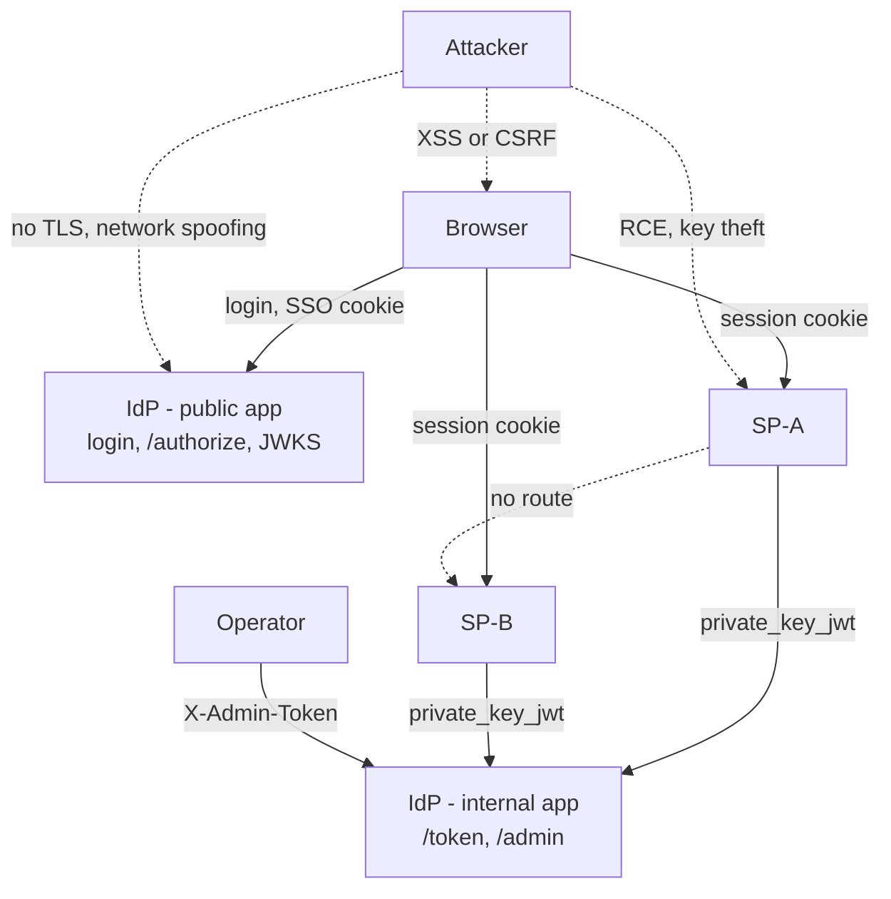

# Identity Fabric

A small, security-serious **Single Sign-On** trust fabric: one **Identity Provider (IdP)**
that two **Service Providers (SP-A, SP-B)** trust to identify a user. OpenID Connect
Authorization Code + PKCE, **private_key_jwt** client authentication, **Ed25519** JWKS
signing. Full architecture in [`DESIGN.md`](./DESIGN.md); the detailed request-by-request
flow write-ups are in [`docs/flows/`](./docs/flows/).

> Not a production identity system: users and SPs are seeded, and the default run is over
> `localhost` HTTP. A faithful, working model of the security mechanics — see the threat
> model below for exactly which guarantees that does and doesn't give you.

---

## How to run

**Requirements:** Docker or Podman.

```bash
cd identity-fabric
./container-start.sh          # Docker if available, else installs and uses Podman
```
Add `127.0.0.1 idp sp-a sp-b` to `/etc/hosts` first if prompted. Seeds the databases
(prints seeded users + a one-time admin token) and launches four services:

| Service | URL |
|---|---|
| IdP (public) | http://idp:9400 |
| IdP (internal — `/token`, `/admin/*`) | http://idp-internal:9410 — no host-published port; reach it with `<engine> compose exec idp-internal ...` |
| SP-A · Atlas Console | http://sp-a:9401 |
| SP-B · Borealis Portal | http://sp-b:9402 |

Admin token is in `<engine> compose logs provisioner`.

Seeded users (email / password / IdP group):

| Email | Password | Group |
|---|---|---|
| `ada@example.com` | `correct horse battery` | engineering |
| `grace@example.com` | `hopper-admin-2024` | engineering |
| `alan@example.com` | `turing-test-pass` | engineering |
| `marie@example.com` | `curie-radium-1903` | finance-dept |
| `linus@example.com` | `torvalds-penguin` | engineering |
| `diana@example.com` | `diana-hr-secure-1` | hr-dept |

Try it: open SP-A → sign in as `ada@example.com` → land back on SP-A, signed in → open
SP-B → signed in immediately, no second login. "Sign out everywhere" from either ends
the session on both.

Stop with `<engine> compose down` (add `-v` to also wipe seeded data — required after a
schema change, see below).

---

## What we build and what we cut from the feature list

The original ask was five features: cross-SP integrity, mutual authentication and
onboarding, signing-key rotation without downtime, compromise containment, and session
lifecycle and persistence.

**All five were built:**

- **Cross-SP integrity** — every token is stamped `aud`/`azp` with the one SP that
  authenticated at `/token`, never a caller-supplied value. Each SP independently checks
  `aud == its own client_id` before trusting a token. A token minted for SP-A is
  rejected the moment SP-B checks the audience.
- **Mutual authentication and onboarding** — SP → IdP via `private_key_jwt` (a signed
  assertion, no shared secret, single-use `jti`). IdP → SP via JWT signature checked
  against published JWKS plus `iss` pinning; that half depends on trusting the network
  path the JWKS was fetched over, since there's no TLS here (see "Cut," below).
  Onboarding supports two paths: a one-shot trusted-provisioner script that seeds both
  SPs at bootstrap, and an Okta-style admin flow (`POST /admin/clients` → pending client
  → SP generates its own keypair → submits only the public half via `register-key`).
  Neither path is automatic self-registration.
- **Signing-key rotation without downtime** — the IdP rotates its active signing key
  while the previous one stays valid in JWKS until explicitly retired, so no SP needs a
  restart. The same rotate/revoke/register lever covers SP keys.
- **Compromise containment** — IdP key revoke, IdP session revoke with back-channel
  logout to every SP the session reached, and SP key revoke, independent of the IdP's
  own key material.
- **Session lifecycle and persistence** — idle and absolute timeouts, SQLite-backed,
  sessions survive a restart, and each SP's session is independent, linked to the IdP
  session only by `idp_sid`.

**Cut, with the reason:**

- **TLS/HTTPS** — out of scope; everything runs on `localhost` over HTTP. The
  IdP-proves-itself-to-SP half of mutual authentication depends on trusting the network
  path a JWKS document was fetched over, not on a certificate chain.
- **Rate limiting or lockout on login** — not built. Argon2id makes each password guess
  expensive, but there's no lockout.
- **Atomic single-use enforcement on the authorization code** — a race window under
  concurrent requests could let the same code be redeemed twice.
- **Replay tracking on back-channel logout tokens** — not built. Low impact since
  revocation is idempotent.
- **A live third SP process** to prove dynamic client registration end to end in one
  run — the admin-API mechanics are demonstrated directly instead, without standing up
  a third service.
- **CSRF tokens** on session-authenticated POST endpoints — not built. `SameSite=Lax`
  on every session cookie is the only defense. Since `idp`, `sp-a`, and `sp-b` are
  distinct hostnames, it does block a real cross-site POST, but it has a gap: it
  doesn't cover `GET /logout`, and there's no server-side token as a second layer.
- **Tamper-evident audit logging** — not built. Every security-relevant action writes a
  JSON log line and a persisted database row, but the trail itself isn't signed or
  hash-chained, so write access to the database could edit history undetected.
- **mTLS on the SP↔IdP connection, and HSM/KMS-backed signing** — both real options,
  both out of this project's scope.

---

## The key decisions we made about the architecture

- **One container and one database per SP**, isolated by the container runtime rather
  than by convention alone. Each SP mounts only its own volume; SP-A and SP-B sit on
  networks with no route between them.
- **The IdP runs as two processes** — a public app (login, `/authorize`, JWKS) and an
  internal app (`/token`, `/admin/*`), the internal one with no port published to the
  host. Network segmentation between SP-A and SP-B alone doesn't protect `/token` or
  `/admin`: a stolen SP key or the admin token is a credential, and a credential check
  doesn't care where the request came from — the internal app's lack of a published
  port is the actual boundary for those two surfaces.
- **No shared secrets.** `private_key_jwt` instead of a client secret for SP-to-IdP
  authentication. Every credential in this system is an asymmetric keypair, so
  revocation is a flag flip, not a race to invalidate a value someone else already has a
  copy of.
- **Authorization and roles, beyond the original feature list.** Authorization is
  IdP-level `groups` checked against a per-client `authorized_groups` list,
  deny-by-default, before any authorization code is minted: a client with
  `authorized_groups=[]` is locked out of every group until an admin grants one, and
  revoking a group blocks new logins/SSO for that group from then on (it doesn't
  retroactively end sessions already active). Roles are decoupled from the IdP
  entirely: the `id_token` carries no `roles` claim; each SP keeps its own local role
  table, so the same identity can hold a different role at each SP.
- **A one-shot, trusted provisioner** handles registration for the two original SPs — a
  script that touches all three databases exactly once, at bootstrap, then exits. The
  admin-driven registration flow for new clients keeps the same property: an explicit
  trusted actor approves every client; there is no automatic self-registration path.
- **A minimal, additive-only migration shim** instead of a full migration framework — it
  adds missing columns on boot, nothing more. A schema change bigger than that (like
  moving from roles to groups) needs a reseed.
- **Structured audit logging.** Every security-relevant action writes a JSON log line
  and a persisted database row, independent of the rest of the request — this is what
  makes every containment action and access decision checkable after the fact instead
  of taken on faith.

---

## Threat Model

**Assets:** user credentials and sessions; the IdP's and each SP's signing keys; the
admin token; the audit trail; which users can reach which SPs and what they can do once
there.



| Threat | Scenario | Mitigation | Residual risk |
|---|---|---|---|
| Cross-tenant access | An authenticated user tries to SSO into an SP they shouldn't reach | IdP-level `groups` checked against per-client `authorized_groups`, deny-by-default, before any code is minted | Group membership itself is seed-only; there's no lever to manage it at the IdP, only to grant or revoke a group's access to a client |
| SP key theft | RCE or a leaked secret exposes an SP's private key | `revoke-key` (instant), `rotate_sp_key.py` (new key, that SP's own database only), `register-key` | Manual — nothing revokes automatically; the window between compromise and revocation depends on someone noticing |
| IdP signing-key compromise | Attacker forges tokens for any user, any SP | Key rotate and revoke, with a JWKS overlap window so rotation needs no SP downtime | Same manual-detection gap as above |
| Session theft via XSS | A script reads or exfiltrates the session cookie | `HttpOnly` on every session cookie | Stops offline replay of a stolen cookie, not a live XSS payload acting through the browser's own same-origin requests while it runs |
| CSRF | A cross-site form or script forces a state change while a session cookie is valid | `SameSite=Lax` on every session cookie — `idp`/`sp-a`/`sp-b` are distinct hostnames, so this is a real cross-site boundary | Doesn't cover `GET /logout`; no server-side token as a second layer |
| Algorithm confusion | Attacker sends `alg: none`, or reuses a public key as an HMAC secret | The verifier only ever accepts `algorithms=["Ed25519"]`, never the token's own header | — |
| Authorization-code replay | A leaked or intercepted code is redeemed by someone other than the SP that requested it | PKCE with the verifier held server-side, single-use code, 60-second expiry | The single-use check isn't atomic under concurrent requests; exploiting it still needs the verifier, which never leaves the SP |
| Client-assertion replay | A captured `private_key_jwt` assertion is resubmitted | `jti` uniqueness enforced by a database primary key, short TTL, bound to the token endpoint | — |
| Audit log spoofing | Attacker forges the source IP recorded against their own actions | `X-Forwarded-For` only trusted from a configured proxy allowlist; uvicorn's own default trust of that header is disabled | The audit trail itself isn't tamper-evident — no signing or hash-chaining of entries |
| IdP impersonation | Attacker sits at the IdP's address and serves a fake JWKS/token endpoint | None — this is what TLS and certificate validation would close | Open. SP trust in the IdP is address-based today, not cryptographically anchored |
| Compromised SP | RCE inside SP-A | No filesystem access to the IdP's or SP-B's database, no network route to SP-B, its key is independently revocable | The container boundary depends on the container runtime itself not being compromised |
| Compromised provisioner | A tampered seed script or image compromises every database it touches | It's the only component that ever touches more than one volume, and only once, before any service starts | No image signing or dependency scanning — a general software-supply-chain gap, not specific to this project |
| Container or kernel escape | A 0-day breaks out of the container runtime | Out of scope; this tier needs separate VMs or hosts | Explicit non-goal |

---

## AI Usage: Where it Helped and Where You Lacked

Where it helped:

- The session and audit-logging design — timeouts, SQLite persistence, structured logs
  with a persisted trail — was solid from the start and never needed a correction.
- Splitting the IdP into public and internal apps came from recognizing, unprompted,
  that network segmentation between the two SPs never actually protected `/token` or
  `/admin` — a credential-based check doesn't care where the request came from.
- The SP-key revocation lever was proposed as part of that same containment discussion,
  not asked for first.
- The uvicorn proxy-header issue that would have quietly undone the audit-log fix was
  caught by testing the fix live and seeing it fail, then tracing it to the actual
  cause.
- Choosing Ed25519 over RSA and ECDSA, and pinning the verifier to a single algorithm,
  predates this round of work, but held up cleanly under direct questions about why.

Where you lacked:

- The biggest one: the original security review missed that any authenticated user
  could SSO into any SP. It found the authorization-code race, the audit-log spoofing,
  and the missing rate limiting, but not this — the most basic access-control question.
  It only came up because you asked directly what happens if a user shouldn't be
  allowed into an SP, and the honest answer at that point was that it would succeed.
- The fix for that was first proposed as per-user grants. Group-based, Okta-style
  assignment — the shape that actually scales — was your redirect.
- Removing roles from the IdP entirely was your question, not a proactive suggestion.
- The Okta-parity registration flow was something you asked for directly, after asking
  how a real IdP onboards an app.
- The CSRF gap was surfaced by your question in this conversation. It had been sitting
  there, unaddressed, through every earlier round.
