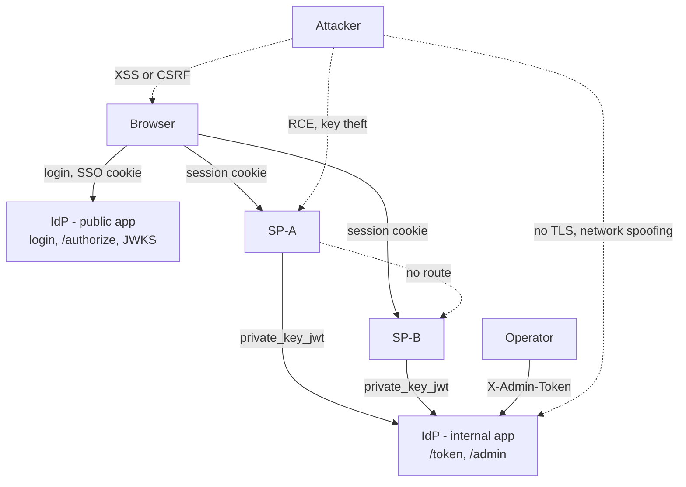

# Identity Fabric

A small, security-serious **Single Sign-On** trust fabric: one **Identity Provider (IdP)**
that two **Service Providers (SP-A, SP-B)** trust to identify a user. OpenID Connect
Authorization Code + PKCE, **private_key_jwt** client authentication, **Ed25519** JWKS
signing.

> Not a production identity system: users and SPs are seeded, and the default run is over
> `localhost` HTTP. A faithful, working model of the security mechanics — see the threat
> model below for exactly which guarantees that does and doesn't give you.

---

## How to run

**Requirements:** Docker or Podman.

### Step 1 — Add hostnames to `/etc/hosts` (one-time, needs sudo)

The browser and the tokens must agree on the same hostnames. Run this in your
**Mac Terminal** (not the IDE terminal — needs an interactive password prompt):

```bash
echo '127.0.0.1  idp  sp-a  sp-b' | sudo tee -a /etc/hosts
```

This maps `idp`, `sp-a`, and `sp-b` to loopback so your browser can reach the
containers by name. Required once per machine; survives reboots.

### Step 2 — Start the stack

```bash
cd identity-fabric
./container-start.sh -d       # Docker if available, else installs and uses Podman
```

The `-d` flag runs detached (returns your terminal). Wait ~30 seconds, then verify:

```bash
podman compose ps   # or: docker compose ps
```

All four services should show `Up`.

### Step 3 — Get the admin token

```bash
podman compose logs provisioner
```

The token is printed under `Admin token`. **Save it** — it is stored to
`/data/idp/admin_token.txt` inside the IdP volume and shown on every boot.
You can also retrieve it at any time with:

```bash
podman compose exec idp-internal cat /data/idp/admin_token.txt
```

### Services

| Service | URL |
|---|---|
| IdP (public — login, JWKS, authorize) | http://idp:9400 |
| IdP (internal — `/token`, `/admin/*`, admin UI) | http://localhost:9410 |
| SP-A · Atlas Console | http://sp-a:9401 |
| SP-B · Borealis Portal | http://sp-b:9402 |

Admin console (browser): http://localhost:9410/admin/login — paste the token from Step 3.

Seeded users (email / password / IdP group):

| Email | Password | Group |
|---|---|---|
| `ada@example.com` | `correct horse battery!1` | engineering |
| `grace@example.com` | `hopper-admin-2024!` | engineering |
| `alan@example.com` | `turing-test-pass!1` | engineering |
| `marie@example.com` | `curie-radium-1903!` | finance-dept |
| `linus@example.com` | `torvalds-penguin!1` | engineering |
| `diana@example.com` | `diana-hr-secure-1!` | hr-dept |

Try it: open SP-A → sign in as `ada@example.com` → land back on SP-A, signed in → open
SP-B → signed in immediately, no second login. "Sign out everywhere" from either ends
the session on both.

Stop with `<engine> compose down` (add `-v` to also wipe seeded data — required after a
schema change, see below).

---

## What we build and what we cut from the feature list

The original ask was five features: cross-SP integrity, mutual authentication and
onboarding, signing-key rotation without downtime, compromise containment, and session
lifecycle and persistence.

**All five were built:**

- **Cross-SP integrity** — every token is stamped `aud`/`azp` with the one SP that
  authenticated at `/token`, never a caller-supplied value. Each SP independently checks
  `aud == its own client_id` before trusting a token. A token minted for SP-A is
  rejected the moment SP-B checks the audience.
- **Mutual authentication and onboarding** — SP → IdP via `private_key_jwt` (a signed
  assertion, no shared secret, single-use `jti`). IdP → SP via JWT signature checked
  against published JWKS plus `iss` pinning; that half depends on trusting the network
  path the JWKS was fetched over, since there's no TLS here (see "Cut," below).
  Onboarding supports two paths: a one-shot trusted-provisioner script that seeds both
  SPs at bootstrap, and an Okta-style admin flow (`POST /admin/clients` → pending client
  → SP generates its own keypair → submits only the public half via `register-key`).
  Neither path is automatic self-registration.
- **Signing-key rotation without downtime** — the IdP rotates its active signing key
  while the previous one stays valid in JWKS until explicitly retired, so no SP needs a
  restart. The same rotate/revoke/register lever covers SP keys.
- **Compromise containment** — IdP key revoke, IdP session revoke with back-channel
  logout to every SP the session reached, and SP key revoke, independent of the IdP's
  own key material.
- **Session lifecycle and persistence** — idle and absolute timeouts, SQLite-backed,
  sessions survive a restart, and each SP's session is independent, linked to the IdP
  session only by `idp_sid`.

**Cut, with the reason:**

Two are real security gaps — the rest are forced by the localhost/demo constraint:

**Real gaps:**
- **TLS / mTLS** — the SP→IdP connection uses plain HTTP. `private_key_jwt` proves
  SP-A's identity to the IdP, but the IdP's side of mutual auth — proving itself to
  the SP — relies on JWKS being fetched over a trusted network path, not a certificate
  chain. In production this needs TLS on both legs and ideally mTLS on the SP→IdP
  channel. Not out of scope — just not built.
- **SP onboarding is not end-to-end** — the admin API mechanics for dynamic client
  registration work (create pending client, submit public key, authorize group), but
  deploying an actual third SP container with its private key seeded into its own
  database is not wired up. The IdP side is complete; the SP-side container deployment
  is not. Demonstrating it requires pointing that out.

**Forced by the demo constraint:**
- **Rate limiting / login lockout** — not meaningful on localhost. Argon2id makes each
  guess expensive; a real deployment adds a lockout layer on top.
- **CSRF tokens** — `SameSite=Lax` is the only defense. It works here because `idp`,
  `sp-a`, `sp-b` are distinct hostnames (a real cross-site boundary), but `GET /logout`
  is unprotected and there's no server-side token as a second layer.
- **Tamper-evident audit log** — events are persisted to SQLite, but the trail isn't
  signed or hash-chained. Direct DB access could edit history undetected.
- **User group mutation at runtime** — which groups a user belongs to is set at seed
  time only. Granting or revoking a whole group's access to an SP is live; moving one
  specific user to a different group requires a reseed.
- **`/etc/hosts` manual setup** — forced by the distinct-hostname requirement that makes
  `SameSite=Lax` a real cross-site boundary. Collapsing everything onto `localhost`
  would quietly undo that cookie isolation.

---

## The key decisions we made about the architecture

- **One container and one database per SP**, isolated by the container runtime rather
  than by convention alone. Each SP mounts only its own volume; SP-A and SP-B sit on
  networks with no route between them.
- **The IdP runs as two processes** — a public app (login, `/authorize`, JWKS) and an
  internal app (`/token`, `/admin/*`), the internal one with no port published to the
  host. Network segmentation between SP-A and SP-B alone doesn't protect `/token` or
  `/admin`: a stolen SP key or the admin token is a credential, and a credential check
  doesn't care where the request came from — the internal app's lack of a published
  port is the actual boundary for those two surfaces.
- **No shared secrets.** `private_key_jwt` instead of a client secret for SP-to-IdP
  authentication. Every credential in this system is an asymmetric keypair, so
  revocation is a flag flip, not a race to invalidate a value someone else already has a
  copy of.
- **Authorization and roles, beyond the original feature list.** Authorization is
  IdP-level `groups` checked against a per-client `authorized_groups` list,
  deny-by-default, before any authorization code is minted: a client with
  `authorized_groups=[]` is locked out of every group until an admin grants one, and
  revoking a group blocks new logins/SSO for that group from then on (it doesn't
  retroactively end sessions already active). Roles are decoupled from the IdP
  entirely: the `id_token` carries no `roles` claim; each SP keeps its own local role
  table, so the same identity can hold a different role at each SP.
- **A one-shot, trusted provisioner** handles registration for the two original SPs — a
  script that touches all three databases exactly once, at bootstrap, then exits. The
  admin-driven registration flow for new clients keeps the same property: an explicit
  trusted actor approves every client; there is no automatic self-registration path.
- **A minimal, additive-only migration shim** instead of a full migration framework — it
  adds missing columns on boot, nothing more. A schema change bigger than that (like
  moving from roles to groups) needs a reseed.
- **Structured audit logging.** Every security-relevant action writes a JSON log line
  and a persisted database row, independent of the rest of the request — this is what
  makes every containment action and access decision checkable after the fact instead
  of taken on faith.

---

## Threat Model

**Assets:** user credentials and sessions; the IdP's and each SP's signing keys; the
admin token; the audit trail; which users can reach which SPs and what they can do once
there.



| Category | Threat | Scenario | Mitigation | Residual risk |
|---|---|---|---|---|
| RBAC | Role self-escalation | An `hr`-role holder calls `POST /hr/assign-role` targeting their own subject, with `role=admin`, or with a role they don't personally hold | The endpoint rejects `admin`, self-targeted assignment, and granting a role the caller doesn't already hold, before touching the role table; the HR panel's role selector only ever offers roles the caller holds | — |
| RBAC | Role assignment strips existing roles | An admin assigns a second role to a user who already holds one | `hr_assign_role` merges the new role into the subject's existing role set instead of replacing it | — |
| RBAC | Role change vs. a live session | A role is granted or revoked while the affected user already has an active session | None — `PublicUser.roles` is a snapshot taken at login and stored on the session row, not re-read from the role table per request | A revoked role stays effective, and a newly granted role doesn't take effect, until the next login |
| SP ↔ IdP comms | No transport authentication | The network path between an SP and `idp-internal` is intercepted or spoofed | None at the transport layer — no TLS, no mTLS in this demo | Every SP↔IdP guarantee below, `private_key_jwt` included, ultimately depends on trusting that network path |
| SP ↔ IdP comms | SP key theft | RCE or a leaked secret exposes an SP's private key | `revoke-key` (checked before any signature verification, so it's instant), `rotate_sp_key.py` (new key, that SP's own database only), `register-key` | Manual — nothing revokes automatically; the window between compromise and revocation depends on someone noticing |
| SP ↔ IdP comms | IdP signing-key compromise | Attacker forges tokens for any user, any SP | Key rotate and revoke, with a JWKS overlap window so rotation needs no SP downtime | An SP's JWKS cache only refreshes when it sees an unrecognized `kid` — a key the IdP has revoked or retired isn't proactively dropped from an SP that already has it cached |
| SP ↔ IdP comms | Client-assertion replay | A captured `private_key_jwt` assertion is resubmitted | `jti` uniqueness enforced by a database primary key, short TTL, bound to the token endpoint | — |
| SP ↔ IdP comms | Admin-API access | Attacker without the admin token calls `/admin/*` | `X-Admin-Token` checked with an Argon2 `verify` against the stored hash (constant-work), on the internal app only, never the public one | A single shared token with no per-operator scoping or expiry |
| Concurrency | Concurrent-write corruption | Many simultaneous requests write to the same SQLite file — including the IdP's public and internal apps, two separate processes both writing `idp.db` | WAL mode + a busy timeout for correct cross-process commit visibility, plus a per-process lock serializing all DB access within one process (SQLite's own busy-timeout retry proved unreliable under real concurrent load in this container environment, confirmed live — see the README's "Where you lacked") | The per-process lock fully serializes DB-touching requests within a service — a burst of concurrent requests queues rather than crashes or corrupts data, but at the cost of throughput; this isn't built to scale past light concurrency |
| Concurrency | First-login role race | Two concurrent first-logins for the same brand-new user | `INSERT ... ON CONFLICT DO NOTHING` makes "create the default role if none exists yet" a single atomic statement, not a check-then-insert | — |
| Cross-tenant | Cross-tenant SSO access | An authenticated user tries to SSO into an SP they shouldn't reach | IdP-level `groups` checked against per-client `authorized_groups`, deny-by-default, before any code is minted | Group membership itself is seed-only; revoking a group blocks new logins/SSO for it from then on, not sessions already active |
| Cross-tenant | Cross-SP token confusion | A token minted for SP-A is presented to SP-B | `aud`/`azp` bound to exactly one SP; each SP checks its own `client_id` independently | — |
| Session | Cookie theft via XSS | A script reads or exfiltrates the session cookie | `HttpOnly`; the cookie itself is a 256-bit CSPRNG opaque token (`secrets.token_urlsafe(32)`) looked up server-side — no claims encoded client-side to tamper with | Stops offline replay of a stolen cookie, not a live XSS payload acting through the browser's own requests while it runs |
| Session | Fixation | Attacker sets a victim's session cookie before they authenticate | Not exploitable — the session id is only ever generated server-side, after authentication completes; no code path sets the cookie from a client-supplied value | — |
| Session | Stale or long-lived reuse | A stolen or old session is replayed indefinitely | Idle and absolute timeouts both checked on every request; the idle window slides, the absolute one doesn't | — |
| JWT configuration | Algorithm confusion | Attacker sends `alg: none`, or reuses a public key as an HMAC secret | The verifier only ever accepts a hardcoded `algorithms=["Ed25519"]` allow-list — it never reads the algorithm from the token's own header | — |
| JWT configuration | Authorization-code replay | A leaked or intercepted code is redeemed by someone other than the SP that requested it | PKCE with the verifier held server-side, single-use code (deleted from storage on first read), 60-second expiry | The single-use check isn't atomic under concurrent requests; exploiting it still needs the verifier, which never leaves the SP |
| JWT configuration | Callback / `state` replay | A captured `state`+`code` pair from a `/callback` URL is replayed | The pending-auth row backing that `state` is deleted on first read; a second `/callback` with the same `state` fails outright | — |
| Browser | CSRF | A cross-site form or script forces a state change while a session cookie is valid | `SameSite=Lax` on every session cookie — `idp`/`sp-a`/`sp-b` are distinct hostnames, so this is a real cross-site boundary | Doesn't cover `GET /logout`; no server-side token as a second layer |
| Infra | Audit log spoofing | Attacker forges the source IP recorded against their own actions | `X-Forwarded-For` only trusted from a configured proxy allowlist; uvicorn's own default trust of that header is disabled | The audit trail itself isn't tamper-evident — no signing or hash-chaining of entries |
| Infra | IdP impersonation | Attacker sits at the IdP's address and serves a fake JWKS/token endpoint | None — this is what TLS and certificate validation would close | Open. SP trust in the IdP is address-based today, not cryptographically anchored |
| Infra | Compromised SP | RCE inside SP-A | No filesystem access to the IdP's or SP-B's database, no network route to SP-B, its key is independently revocable | The container boundary depends on the container runtime itself not being compromised |
| Infra | Compromised provisioner | A tampered seed script or image compromises every database it touches | It's the only component that ever touches more than one volume, and only once, before any service starts | No image signing or dependency scanning — a general software-supply-chain gap, not specific to this project |
| Infra | Container or kernel escape | A 0-day breaks out of the container runtime | Out of scope; this tier needs separate VMs or hosts | Explicit non-goal |

---

## AI Usage: Where it Helped and Where it Fell Short

**Where it helped:**

- The session and audit-logging design — timeouts, SQLite persistence, structured logs
  with a persisted trail — was correct from the start and required no correction.
- The uvicorn proxy-header issue — where uvicorn's own `ProxyHeadersMiddleware` was
  silently rewriting `request.client` before application code ran, undermining the
  audit-log source-IP fix — was caught by testing the fix live, seeing it fail, and
  tracing it to the actual transport-layer cause rather than patching the symptom.
- Choosing Ed25519 and pinning the verifier to a hardcoded algorithm allowlist — closing
  algorithm-confusion attacks including `alg: none` — was a correct, well-reasoned
  choice that held up under scrutiny.

**Where it fell short:**

- The IdP was originally a single process with `/token` and `/admin` published on the
  same port as the login UI — meaning the internal surface was reachable from anywhere
  the public surface was. The split into two separate processes (public app and internal
  app) and placing the internal one on a network with no published host port was not a
  proactive design decision. It was identified and corrected only after the gap was
  pointed out.
- The SP-key revocation lever followed from the same gap — an SP's private key had no
  dedicated revocation path until the question of what happens when it leaks was raised.
- The original security review missed the most basic access-control question: any
  authenticated user could SSO into any registered SP. It found the authorization-code
  race, the audit-log spoofing gap, and the missing rate limiting — but not the absence
  of SP-level access control entirely.
- The first proposed fix for that gap was per-user grants — which does not scale. The
  correct shape, group-based assignment (the model Okta and Azure AD use), was not the
  initial proposal.
- Roles were initially kept in the IdP. The correct design — moving them out entirely
  into per-SP tables so each application owns its own permission vocabulary — was not a
  proactive decision.
- Dynamic client registration (the flow where a new SP is created in a pending state,
  generates its own keypair, and submits only the public half) was not built initially.
  It was added only after the question of how a real IdP onboards a new application
  was raised.
- The CSRF gap — `GET /logout` unprotected and no server-side token as a second layer
  beyond `SameSite=Lax` — was present from the start and was not caught in any earlier
  review pass.
- Database concurrency was not load-tested. When it was, two real bugs appeared: a
  check-then-insert race in first-login role creation (`UNIQUE constraint failed`), and
  a single-shared-connection "fix" from an earlier round that made concurrent access
  worse rather than better — the token endpoint failed to find a code the public app
  had just written, in up to ~98% of requests at 60 concurrent logins. Fixed with WAL
  mode and a per-process write lock, verified by re-running the same concurrency test
  repeatedly.

---

## Demo vs. Reality — what was relaxed for this demo and why

Two deliberate departures from the real security design were made to support live
demonstration. Both are documented here so the gap is explicit, not accidental.

### Port 9410 is published to the host

**In this demo:** `compose.yaml` exposes `9410` on the host so the admin console
(`http://localhost:9410/admin/login`) is reachable in a browser.

**In reality:** the internal IdP surface (`/token`, `/admin/*`) has **no published
port**. It is reachable only from inside the container network — i.e. from SP-A and
SP-B over the compose network, or via `podman compose exec`. The reason is that
`private_key_jwt` and the admin token are credential-based checks: they don't care
where the request came from, only what it can prove. Publishing the port means a
stolen SP key or admin token is exploitable from anywhere on the host network, not
just from inside the segmented topology. Removing the `ports:` entry from the
`idp-internal` service in `compose.yaml` restores the intended boundary.

### Admin token is stored in plaintext

**In this demo:** at first boot the admin token is written to
`/data/idp/admin_token.txt` inside the IdP volume and printed on every subsequent
boot so it is never lost between restarts.

**In reality:** the admin token is **shown exactly once** — at first boot — and
is never stored in recoverable form. Only its Argon2id hash is persisted in the
database. If the token is lost, the only recovery is to wipe the database and
reseed, which generates a new token. This is intentional: a token file on disk
is a credential at rest, and its confidentiality depends entirely on filesystem
permissions — weaker than keeping only the hash. For a production deployment,
remove the `token_file.write_text(...)` line in `seed.py` and the corresponding
read-back in `_seed_admin`, restoring the original show-once behaviour.
